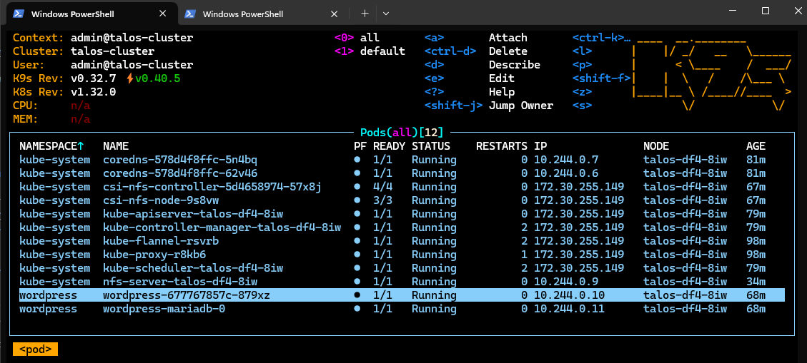

# Talos single node cluster

This is a short guide on how to setup a Talos single node cluster.  
It is based on the [official talos documentation](https://www.talos.dev/v1.10/talos-guides/install/virtualized-platforms/kvm/).  

## Preperation

First clone this repo and download required tools.

```bash
git clone https://github.com/bihalu/talos.git
cd talos
wget https://factory.talos.dev/image/89b50c59f01a5ec3946078c1e4474c958b6f7fe9064654e15385ad1ad73f536c/v1.10.5/metal-amd64.iso
wget https://github.com/siderolabs/talos/releases/download/v1.10.5/talosctl-linux-amd64 -O talosctl
chmod +x talosctl
wget https://dl.k8s.io/release/v1.33.2/bin/linux/amd64/kubectl
chmod +x kubectl
sudo apt install -y yq
wget https://github.com/derailed/k9s/releases/download/v0.50.9/k9s_linux_amd64.deb
sudo dpkg --install k9s_linux_amd64.deb
wget https://get.helm.sh/helm-v3.17.4-linux-amd64.tar.gz -O - | tar Cxzf /tmp - && cp /tmp/linux-amd64/helm .

```

## Setup VM

* launch QEMU/KVM
* new vm (generic linux)
* iso -> metal-amd64.iso
* name talos
* memory 4GB
* network default switch
* hard disk 40GB
* settings boot order -> 1. SATA CDROM, 2. VirtIO disk
* connect and boot

> Take note of control plane ip-address, you have to set it next.

## Install talos

### Generate talos config

```bash
# set control plane IP variable
export CONTROL_PLANE_IP='192.168.122.2'

# Generate and patch talos config
./talosctl gen config talos-cluster https://$CONTROL_PLANE_IP:6443 --output-dir . --force --config-patch-control-plane "@patch-qemu.yaml"

```

### Apply talos config

```bash
# Apply config to control plane node
./talosctl apply-config --insecure --nodes $CONTROL_PLANE_IP --file controlplane.yaml

```

> Now talos VM is installing and after a minute stage should be booting, kubelet healthy and connectivity OK.

## Bootstrap cluster

```bash
# Copy talosconfig
mkdir -p ~/.talos
cp talosconfig ~/.talos/config

# Use following command to set node and endpoint permanantly in config so you dont have to type it everytime
./talosctl config endpoint $CONTROL_PLANE_IP
./talosctl config node $CONTROL_PLANE_IP

# Bootstrap cluster
./talosctl bootstrap

```
> Bootstrap takes a few minutes. Wait until stage is running and ready.


```powershell
# Generate kubeconfig
./talosctl kubeconfig .

# Copy kubeconfig
mkdir -p ~/.kube
cp kubeconfig ~/.kube/config

```

## Storage

### install csi-driver-nfs

```bash
./helm repo add csi-driver-nfs https://raw.githubusercontent.com/kubernetes-csi/csi-driver-nfs/master/charts

./helm repo update

./helm pull csi-driver-nfs/csi-driver-nfs --version 4.11.0

./helm upgrade --install csi-driver-nfs csi-driver-nfs-4.11.0.tgz --namespace kube-system --version v4.11.0

./kubectl apply -f nfs-server-service.yaml

./kubectl apply -f nfs-csi-storageclass.yaml

```

Finaly you can access your cluster with k9s tool.

```bash
./k9s

```



## Finish

> Shutdown the VM and unmount iso, so that the next time you don't boot from the iso.  
  In addition, it makes sense to create a snapshot of the VM.

Now have fun with your single node talos cluster ;-)


## Bonus

### Install sample app wordpress via helmchart

```bash
./helm repo add bitnami https://charts.bitnami.com/bitnami

./helm repo update

./helm pull bitnami/wordpress --version 24.1.7

./helm upgrade --install wordpress wordpress-24.1.7.tgz --create-namespace --namespace wordpress --version 24.1.7 --set service.type=NodePort --set service.nodePorts.http=30000 --set mariadb.auth.rootPassword="topsecret" --set mariadb.auth.password="secret" --set wordpressUsername="admin"

```
