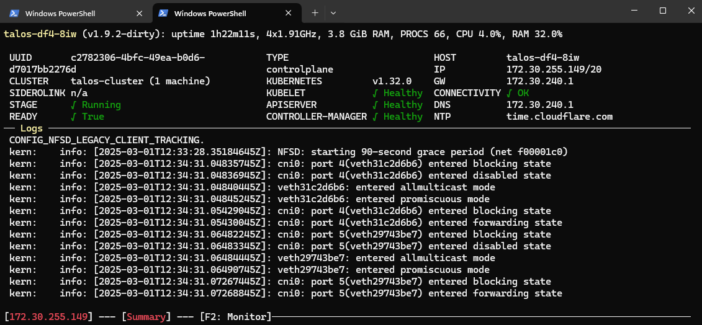
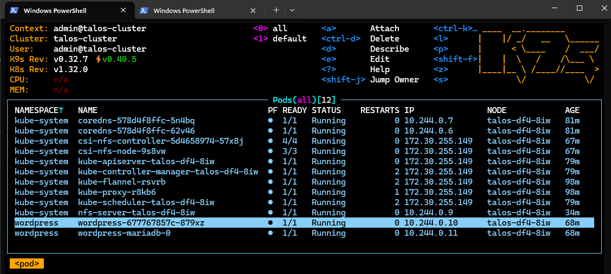

# Talos single node cluster

This is a short guide on how to set up a Talos single node cluster.  
It is based on the [official talos documentation](https://www.talos.dev/v1.9/talos-guides/install/virtualized-platforms/hyper-v/#pushing-config-to-the-nodes).  
First clone the repo and and download tools.

```powershell
git clone https://github.com/bihalu/talos.git
cd talos
wget https://github.com/siderolabs/talos/releases/download/v1.9.2/metal-amd64.iso -OutFile metal-amd64.iso
wget https://github.com/siderolabs/talos/releases/download/v1.9.2/talosctl-windows-amd64.exe -OutFile talosctl.exe
wget https://dl.k8s.io/release/v1.32.0/bin/windows/amd64/kubectl.exe -OutFile kubectl.exe
wget https://github.com/derailed/k9s/releases/download/v0.32.7/k9s_Windows_amd64.zip -OutFile k9s_Windows_amd64.zip
wget https://get.helm.sh/helm-v3.17.0-windows-amd64.zip -OutFile helm-v3.17.0-windows-amd64.zip
Expand-Archive k9s_Windows_amd64.zip -DestinationPath tmp
Expand-Archive helm-v3.17.0-windows-amd64.zip -DestinationPath tmp
copy tmp/k9s.exe .
copy tmp/windows-amd64/helm.exe .
Remove-Item -Recurse -Force tmp
Remove-Item k9s_Windows_amd64.zip
Remove-Item helm-v3.17.0-windows-amd64.zip

```

## Setup VM

* launch hyper-v manager -> virtmgmt.msc
* new vm
* name talos
* generation 2
* memory 4GB (no dynamic)
* network default switch
* hard disk 40GB
* mount iso -> metal-amd64.iso
* settings firmware boot order -> 1. dvd, 2. disk, 3. network
* settings security disable secure boot
* connect and boot

> Take note of control plane ip-address, you have to set it next.

## Install talos

```powershell
# set control plane IP variable
$CONTROL_PLANE_IP='172.26.91.19'

# Generate talos config
./talosctl gen config talos-cluster https://$($CONTROL_PLANE_IP):6443 --output-dir .

# Apply config to control plane node
./talosctl apply-config --insecure --nodes $CONTROL_PLANE_IP --file .\controlplane.yaml

```

> Now talos VM is installing and after a minute stage should be booting, kubelet healthy and connectivity OK.



## Bootstrap cluster

```powershell
# Copy talosconfig
mkdir -p ~/.talos
cp talosconfig ~/.talos/config

# Use following command to set node and endpoint permanantly in config so you dont have to type it everytime
./talosctl config endpoint $CONTROL_PLANE_IP
./talosctl config node $CONTROL_PLANE_IP

# Bootstrap cluster
./talosctl bootstrap

```
> Bootstrap takes a few minutes. Wait until stage is running and ready.

```powershell
# Generate kubeconfig
./talosctl kubeconfig .

# Copy kubeconfig
mkdir -p ~/.kube
cp kubeconfig ~/.kube/config

```


Finaly you can access your cluster with k9s tool.

```powershell
./k9s

```



## Finish

```powershell
./kubectl taint nodes talos-2f9-lvy node-role.kubernetes.io/control-plane=:NoSchedule-
```

> Shutdown the VM and unmount iso, so that the next time you don't boot from the iso.  
  In addition, it makes sense to create a snapshot of the VM.

Now have fun with your single node talos cluster ;-)

## Storage

add machine->kubelet->extramounts to controlplane.yaml

```yaml
machine:
    kubelet:
        extraMounts:
        - destination: /var/local/nfs
          type: bind
          source: /var/local/nfs
          options:
          - rbind
          - rshared
          - rw

```

add machine->pods to controlplane.yaml

```yaml
machine:
    pods:
        - apiVersion: v1
          kind: Pod
          metadata:
            name: nfs-server
            namespace: kube-system
          labels:
            app: nfs-server
          spec:
            containers:
            - name: nfs-server
              image: docker.io/itsthenetwork/nfs-server-alpine:12
              ports:
              - name: tcp-2049 
                containerPort: 2049
                protocol: TCP
              - name: udp-111
                containerPort: 111
                protocol: UDP
              volumeMounts:
              - mountPath: /data
                name: nfs-storage
              env:
              - name: SHARED_DIRECTORY
                value: /data
                securityContext:
                privileged: true
            volumes:
            - hostPath:
              path: /var/local/nfs
              type: DirectoryOrCreate
              name: nfs-storage

```

apply config

```powershell
./talosctl apply-config -f controlplane.yaml

```

install csi-driver-nfs

```powershell
./helm repo add csi-driver-nfs https://raw.githubusercontent.com/kubernetes-csi/csi-driver-nfs/master/charts

./helm pull csi-driver-nfs/csi-driver-nfs --version v4.9.0

./helm upgrade --install csi-driver-nfs csi-driver-nfs-v4.9.0.tgz --namespace kube-system --version v4.9.0

./kubectl apply -f nfs-server-service.yaml

./kubectl apply -f nfs-csi-storageclass.yaml

```

## Wordpress

install wordpress helmchart

```powershell
./helm repo add bitnami https://charts.bitnami.com/bitnami

./helm pull bitnami/wordpress --version 24.1.7

./helm upgrade --install wordpress wordpress-24.1.7.tgz --create-namespace --namespace wordpress --version 24.1.7 --set service.type=NodePort --set service.nodePorts.http=30000 --set mariadb.auth.rootPassword="topsecret" --set mariadb.auth.password="secret" --set wordpressUsername="admin"

```
